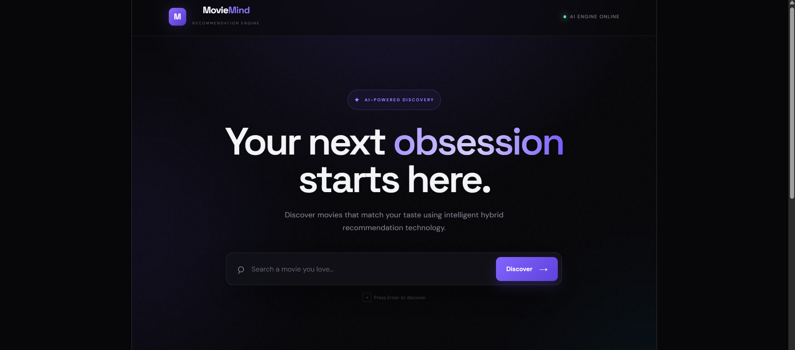
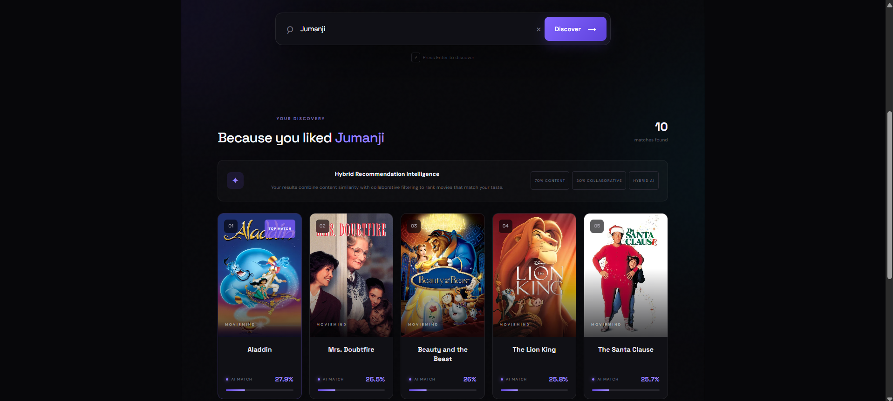
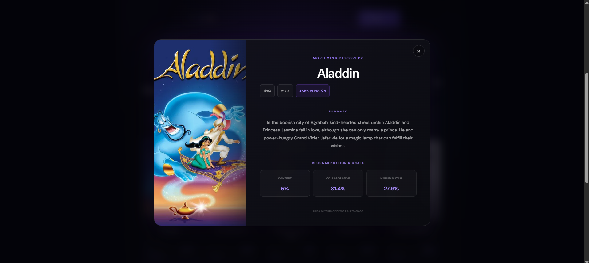

# 🎬 MovieMind — Hybrid Movie Recommendation Engine

> AI-powered movie recommendation system combining content-based filtering and collaborative filtering to discover movies tailored to your taste.

MovieMind is a full-stack AI/ML movie recommendation platform that recommends movies based on a movie the user already likes.

## ✨ Features

- 🎯 Content-Based Filtering using TF-IDF and cosine similarity
- 👥 Collaborative Filtering using MovieLens user-rating patterns
- 🔗 Hybrid Recommendation combining both approaches
- 🖼️ TMDB API for movie posters and metadata
- 🔎 Movie search with suggestions
- 📊 Content, collaborative, and hybrid recommendation scores
- ⚡ FastAPI backend
- ⚛️ React + Vite frontend
- 🎨 Modern dark glassmorphism UI
- 📱 Responsive movie recommendation interface

🖥️ Screenshots

🏠 MovieMind Interface

 
 
🎬 Hybrid Recommendations

 
 
🎥 Movie Details

## 🧠 How It Works

### Content-Based Filtering

Movie metadata such as genres, keywords, cast, crew, and overview is converted into TF-IDF vectors.

Cosine similarity is then used to find movies with similar content.

### Collaborative Filtering

MovieLens ratings are used to create a user-movie rating matrix.

The matrix is processed using:

- Truncated SVD
- Latent movie representations
- K-Nearest Neighbors

This identifies relationships between movies based on user-rating patterns.

### 🔀 Hybrid Recommendation

The final recommendation score combines both approaches:

**70% Content Similarity + 30% Collaborative Similarity**

The two recommendation signals are combined and ranked to produce the final movie recommendations.

## 🏗️ System Architecture

User → React + Vite Frontend → FastAPI Backend → Content-Based Filtering + Collaborative Filtering → Hybrid Ranking → TMDB API → Movie Recommendations

## 📊 Machine Learning Pipeline

### Data Preparation

The collaborative dataset is filtered to remove extremely sparse movies.

Final collaborative dataset:

- 671 users
- 3,496 movies
- 90,072 ratings

### Content Pipeline

Movie Metadata → Text Features → TF-IDF → Cosine Similarity → Similar Movies

### Collaborative Pipeline

MovieLens Ratings → User-Movie Matrix → Truncated SVD → Latent Movie Features → KNN → Similar Movies

### Hybrid Pipeline

Content Score + Collaborative Score → Hybrid Score → Ranked Recommendations

## 🛠️ Technology Stack

### Frontend

- React
- Vite
- JavaScript
- CSS
- Responsive UI
- Glassmorphism design

### Backend

- Python
- FastAPI
- Uvicorn
- Pandas
- NumPy
- Scikit-learn
- Joblib

### Machine Learning

- TF-IDF
- Cosine Similarity
- K-Nearest Neighbors
- Truncated SVD
- Content-Based Filtering
- Collaborative Filtering
- Hybrid Recommendation

### External API

- TMDB API

### Development Tools

- VS Code
- Git
- GitHub
- Jupyter Notebook

## 📁 Project Structure

moviemind-hybrid-recommendation-engine/

├── backend/
│   ├── main.py
│   └── rebuild_collaborative.py

├── frontend/
│   ├── public/
│   └── src/
│       ├── assets/
│       ├── App.jsx
│       ├── App.css
│       ├── index.css
│       └── main.jsx

├── ml/
│   └── notebooks/
│       └── 01_data_exploration.ipynb

├── requirements.txt
├── .gitignore
└── README.md

## 🚀 Getting Started

### 1. Clone the Repository

git clone https://github.com/patilshreya24/moviemind-hybrid-recommendation-engine.git

cd moviemind-hybrid-recommendation-engine

### 2. Create a Virtual Environment

python -m venv .venv

On Windows:

.venv\Scripts\Activate.ps1

### 3. Install Python Dependencies

pip install -r requirements.txt

### 4. Configure TMDB API

Create a file named:

backend/.env

Add your TMDB credentials:

TMDB_API_KEY=your_tmdb_api_key

TMDB_READ_ACCESS_TOKEN=your_tmdb_read_access_token

Do not commit your .env file to GitHub.

## ▶️ Run the Backend

Open a terminal in the backend directory:

cd backend

python -m uvicorn main:app --reload

Backend:

http://127.0.0.1:8000

FastAPI documentation:

http://127.0.0.1:8000/docs

## ⚛️ Run the Frontend

Open another terminal:

cd frontend

npm install

npm run dev

Frontend:

http://localhost:5173

## 🔌 API Endpoints

### Health Check

GET /

Returns the current status of the MovieMind recommendation engine.

### Get Movies

GET /movies

Returns the available movie titles used by the recommendation system.

### Get Recommendations

GET /recommend?movie=Jumanji&n=10

Returns ranked movie recommendations using the hybrid recommendation engine.

## 🎯 Example

For an input movie such as **Jumanji**, MovieMind analyzes the movie and combines content and collaborative signals to generate recommendations.

Example recommendations include:

- Aladdin
- Mrs. Doubtfire
- Beauty and the Beast

Each recommendation includes an AI match score and movie poster.

## 📊 Recommendation Signals

### Content Score

Measures how similar the movie's content representation is to the input movie.

### Collaborative Score

Measures how strongly the movie is related to the input movie based on user-rating patterns.

### Hybrid Score

Combines both signals using:

**70% Content + 30% Collaborative**

This provides a more balanced recommendation than relying on a single technique.

## 🧪 Machine Learning Models

The project uses the following trained components locally:

- content_tfidf.pkl
- content_knn.pkl
- content_data.pkl
- collab_svd.pkl
- collab_knn.pkl
- movie_latent.pkl
- user_movie_matrix.pkl

### Content Model

TF-IDF → Content Feature Vectors → KNN → Similar Movies

### Collaborative Model

User-Movie Rating Matrix → Truncated SVD → Movie Latent Representations → KNN → Collaborative Similarity

## 🔄 Movie ID Mapping

MovieMind uses both MovieLens and TMDB movie identifiers.

The systems are connected using links_small.csv to map MovieLens movie IDs to TMDB movie IDs.

This allows collaborative recommendations to work with TMDB movie metadata.

## 🎨 User Interface

The frontend provides a modern cinematic movie discovery experience with:

- Dark theme
- Purple accents
- Glassmorphism panels
- Movie recommendation cards
- Ranking indicators
- AI match percentages
- Search suggestions
- Loading states
- Error handling
- Recommendation signal breakdown
- Movie information and metadata

## 🔐 Security

Sensitive credentials are excluded from version control.

The following files should never be committed:

- .env
- __pycache__/
- *.pyc

Large datasets and generated model files are also excluded from the Git repository where appropriate.

## 📚 Dataset

The project uses movie metadata and rating information from MovieLens and TMDB-related datasets.

The datasets contain information such as:

- Movie titles
- Genres
- Keywords
- Cast
- Crew
- Movie descriptions
- User ratings
- Movie identifiers

## 📈 Future Improvements

- Personalized recommendations using user profiles
- Rating-based preference learning
- Genre preference controls
- Mood-based recommendations
- Multi-movie preference input
- Recommendation explanations
- Advanced ranking models
- Recommendation history
- User accounts
- Cloud deployment
- Model serving optimization
- Larger-scale collaborative filtering

## 👩‍💻 Author

**Shreya Patil**

AI & ML

GitHub: https://github.com/patilshreya24

## 📜 License

This project is intended for educational, academic, and portfolio purposes.

## 🎥 TMDB Attribution

This product uses the TMDB API but is not endorsed or certified by TMDB.

Movie posters and movie metadata displayed through the application are provided by TMDB.
